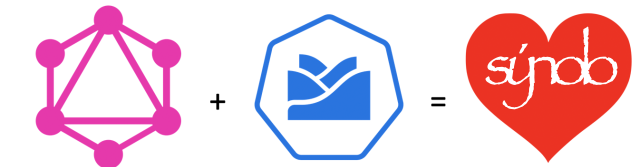
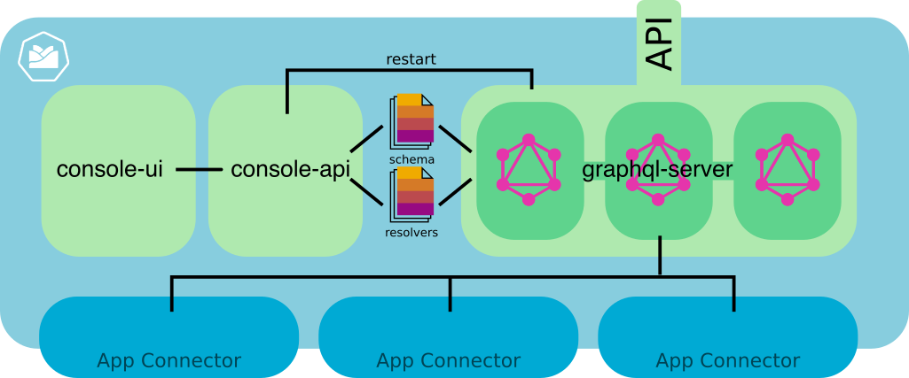

# synolo - GraphQL for Project Kyma

> sýnolo (Greek)
> total, aggregate, aggregation, mass, summation

[GraphQL](https://graphql.org/) is a query language for APIs and execution engine to fulfill those queries. It was originally created by Facebook. It's increasingly known among developers and a potential extension / in some cases an alternative to REST-based APIs. You can [read more about GraphQL in a series of blog posts](https://cxlabs.sap.com/tag/graphql/) and see the [latest GraphQL spec here](https://graphql.github.io/graphql-spec/).

[Project Kyma](https://kyma-project.io/) is an open-source project that aims to extend and customize cloud-based and on-premise enterprise applications in a cloud-native, quick and modern way. At this point in time, there is no official way of extending Kyma with features of GraphQL. Therefore, I created this protoype. 

sýnolo is Greek for "total" or "aggregate". This project is called sýnolo, as one of the core features of GraphQL is aggregating different data sources across multiple back-end services. It just relates to one feature of GraphQL, but possibly the most powerful one in the context of enterprise applications.

> PLease note: I do work at SAP CX but this project is a private / spare time contribution. The code part of this repository is a proof of concept implementation. Use at your own risk. The main intent is to increase awareness around GraphQL and it's importance for the enterprise developer community around Kyma.

## Architecture Overview

This repository consists of three sub-projects, each yielding a seperate docker image. For your conveniencer, docker images have been uploaded to docker hub and these images are refeenced from the default k8s resources which are part of these projects. 

Here's a quick overview with a description of each sub-project:

- [__graphql-server__](graphql-server/README.md): This project includes a code for a Yoga-based GraphQL server. Yoga is a node.js based GraphQL server which is based on the popular Apollo GraphQL server. My specific implementation uses schema-stitching to combine individual GraphQL schema files (types directory) to one holistic GraphQL schema. For the resolvers, the same principle is used, e.g. all resolvers of the resolvers directory are combined into the resolvers of the GraphQL server. The types and resolvers directories are intended to be overwritten by a Kubernetes ConfigMap volume mount later. This effectively makes the types and resolvers editable by an external process, in this case the graphql-api via graphql-console.

- [__graphql-console-ui__](graphql-console-ui/README.md): This project includes a minimal and basic Vue-based UI for the Kyma console. It includes the Kyma resources necessary to add an item to the Kyma console and includes the basic UI for editing the list of available types and resolvers via simple HTML text areas. This UI communicates with the graphql-api.

- [__graphql-console-api__](graphql-console-api/README.md): The graphql-api uses the Kubernetes node.js API to load, edit and update the ConfigMaps for types and resolvers. It also enables the graphql-ui to restart the GraphqQL server, which essentially kills all pods of a graphql deployment for reloading them with the latest ConfigMaps. 

Please click on the links above for the specific documentation. 

## Get started
To get started quickly, we've created public docker images which are referenced from the k8s resource folders of the three sub-projects. Please note that you will need to change a few settings, based on your specific kyma cluster hostname and setup. But it should be fairly straightforward, so just go ahead!

For deploying to your own kyma cluster:

1. Follow [__graphql-server__](graphql-server/README.md) to deploy a default graphql-server deployment
2. If you want to be able to change the types and resolvers via a kyma add-on also deploy the [__graphql-console-api__](graphql-console-api/README.md) followed by the [__graphql-console-ui__](graphql-console-ui/README.md).

