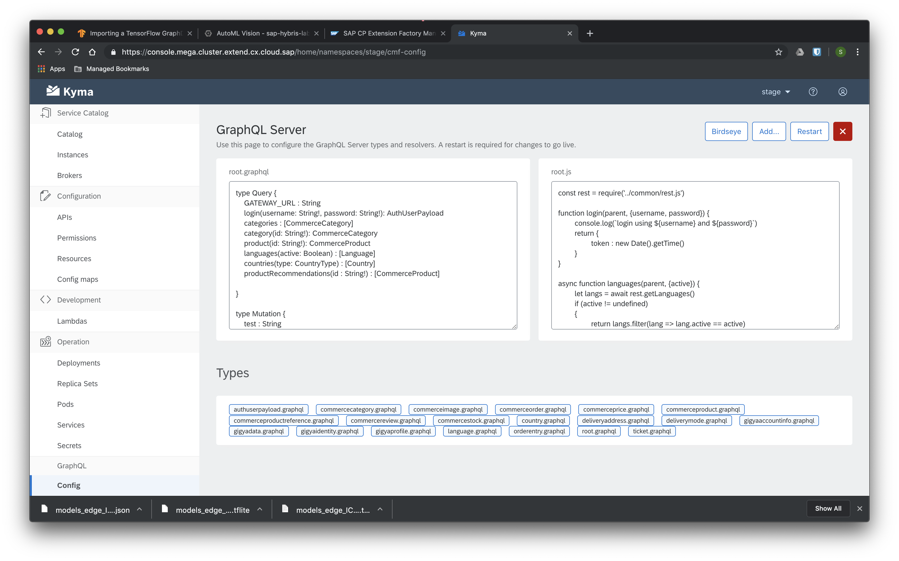

# graphql-console-ui

This is a simple vue frontend web application that exposes a simple management UI for the graphql types and resolvers. It is including Luigi to make it compatible with the Kyma console UI. 

Once you've built your docker image and deployed to your Kyma cluster, the UI will look similar to the following image:



## Project setup
```
yarn install
```

Please note: the backend URL is set via the `public/config.js` file. For development purposes, the backend URL is set to `localhost:3000`. When running the container in the cluster, be sure to replace the config.js file via a ConfigMap. 

### Compiles and hot-reloads for development
```
yarn run serve
```

If you run the ui locally, the console-ui-backend is expected at `localhost:3000` - this can be changed via the `.env.development` file. 

### Compiles and minifies for production
```
yarn run build
```

Runnung the supplied docker file will build the project and package it up in a production-ready docker container. Please make sure that the `.env.production` file contains the correct console-api backend address. This cannot be changed during container startup, so you currently need to create your own docker image for this. 