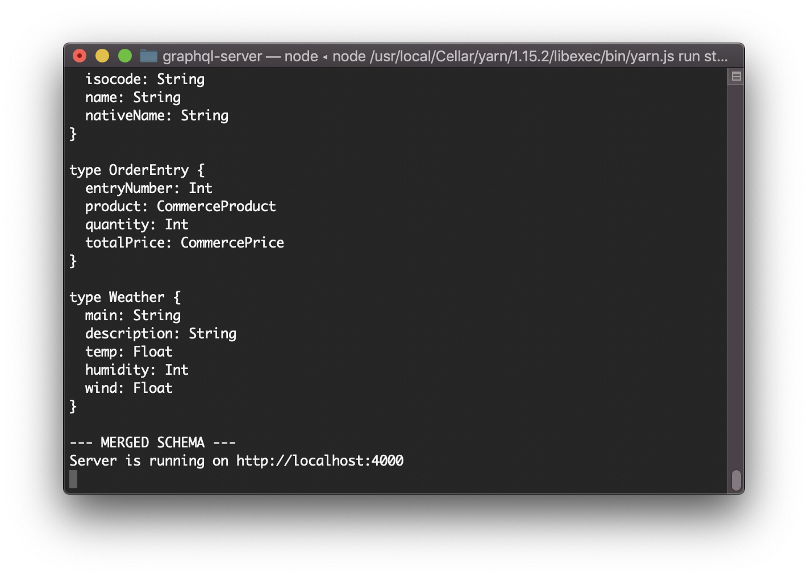

# graphql-server

This is a graphql server based on yoga. The graphql schema files are stored in the 'types' subdirectory and the resolvers are stored in the 'resolvers' directory. Upon starting up, the files in these directories are merged into one holistic GraphQL schema and a combined resolvers object. 

## Local testing
By default, the GraphQL server will include types and resolvers for a basic commerce setup. To show the extensibility powers of GraphQL, we've also included resolvers for a a weather service, e.g. the OpenWeather service. You need to run the server like this:

```
LOCAL=true GATEWAY_URL=http://localhost:8080 OPENWEATHER_APP_ID=XXX yarn run start
```
Here, GATEWAY_URL points to a local port-forwarding to a Kyma/Kybernetes App Connector service (see below). OPENWEATHER_APP_ID needs to be a vaid app id of the OpenWeather service. 

If the graphql schema and resolvers are in sync, as well as the two env variables are set, then startup will look like this:



## Deployment to a Kyma cluster
For deployment to a kyma cluster, have a look at the `k8s` directory. You will need to modify the k8s files to your local environment. This applies especially to the service binding usage resource. We recommend to create a kyma lambda that uses the Commerce App Connector and inspect the lambda function to figure out the details for the `servicebindingusage.yaml`. The ServiceBindingUsage resource is later responsible for automatically adding the GATEWAY_URL env variable to your pods so they can find the application connector services. 

Once the ServiceBindingUsage is setup, modify the `all.yaml` file to your needs and then execute it via `kubectl`:

```
kubectl apply -f k8s/all.yaml
```

## ConfigMaps from Folder
If you wish to overwrite the `types` and `resolvers` directories, you need to create ConfigMaps in the namespace you've deployed the GraphQL server. 
These examples are for the `stage` namespace - it will create ConfigMaps with the contents of the current directories. It's a great way to get started. 

### Resolvers
```
KUBECONFIG=~/Downloads/kubeconfig kubectl create configmap graphql-resolvers --from-file=./resolvers/ -n stage
```

### Types
```
KUBECONFIG=~/Downloads/kubeconfig kubectl create configmap graphql-types --from-file=./types/ -n stage
```

## How to access services e.g. Commerce Cloud via App Connector locally
- Access the kyma UI and enter the namespace you're in
- click the service instance that you wnat to connect to, e.g. `ec-occ-commerce-webservices-v2-8cd3d-weepy-injury`
- if a lambda is bound to the instance, ther will be an entry in bound applications. 
- click the secret and decode it - from the URL you can infer the service name that you need to port-forward to. .e.g GATEWAY_URL is GATEWAY_URL
`http://app-graphql-ccv2-3f3a59e7-1389-4210-bd9b-ad420a130155.kyma-integration.svc.cluster.local` then the service name is `app-graphql-ccv2-3f3a59e7-1389-4210-bd9b-ad420a130155` in the `kyma-integration` namespace.
- Create a port forwarding like this: `kubectl port-forward service/app-graphql-ccv2-3f3a59e7-1389-4210-bd9b-ad420a130155 8080:80 -n kyma-integration`
- You can now access the service via `localhost:8080` but you need to pass the `Host: app-graphql-ccv2-3f3a59e7-1389-4210-bd9b-ad420a130155` header otherwise the application connector proxy service cannot correctly identify the request. 
